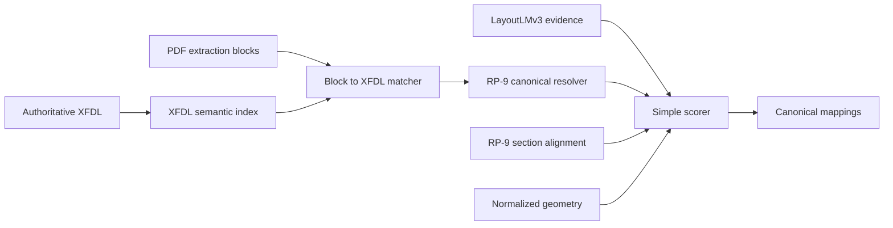

# XFDL-First RP-9 Mapping Architecture

## Status

Initial staging-only implementation for ACORD 125. Production remains on the existing RP-8 pipeline.

## Authority Order

1. **XFDL** is the semantic source of truth for field identity, labels, help text, control/answer type, page membership, grouping prefix, and geometry.
2. **RP-9** is the only mapping target. XFDL semantic paths resolve directly to RP-9 canonical nodes or through explicit representation bridges.
3. **LayoutLMv3** validates XFDL/RP-9 candidates. It contributes evidence but does not replace an authoritative XFDL match. It may provide a candidate only when XFDL cannot resolve an unlabeled field.
4. **Geometry** and **section membership** are secondary alignment signals.

## Parsed XFDL Semantics

The parser reads:

- control SID and normalized semantic path
- control type (`field`, `check`, `combobox`, `popup`, `signature`)
- answer type (`text`, `boolean`, `select`, `date`, `number`, `currency`, `signature`)
- nearest semantically relevant label
- help text
- page number
- absolute geometry
- inferred section membership
- semantic-path group prefix

The ACORD 125 source currently yields 552 controls across four XFDL pages, including 164 boolean controls.

## Scoring

The initial score is intentionally small and inspectable:

$$
S = 0.55X + 0.20L + 0.15R + 0.10G
$$

Where:

- $X$: XFDL label/path/help and answer-type match
- $L$: LayoutLMv3 validation probability for the RP-9 node
- $R$: RP-9 section alignment
- $G$: normalized geometry alignment

Every suggestion includes the four component scores and its XFDL SID/path provenance.

## Staging Gate

The XFDL-first branch activates only when all conditions hold:

- `SEMANTIC_BASELINE=RP-9`
- `DEPLOYMENT_ENVIRONMENT=staging`
- `XFDL_PRIMARY_MAPPING=1`
- source/family identifies ACORD 125

The branch bypasses:

- `mapBlocksWithAcord`
- promoted dictionary suggestions
- RP-8/Wave heuristic fallback
- reducer arbitration artifacts
- multi-stage usability inference

The existing pipeline remains available outside this gate.

## Initial Implementation

- `backend/api/src/services/xfdlRp9MappingPipeline.ts`
  - XFDL parser/index
  - explicit XFDL-to-RP-9 representation bridges
  - block matcher
  - LayoutLM validator/fallback
  - four-component scorer
  - pipeline diagnostics
- `backend/api/src/api/mapFields.ts`
  - staging-gated pipeline routing
  - response contract: `mappingPipeline` and `xfdlDiagnostics`
- `backend/api/tests/xfdlRp9MappingPipeline.test.cjs`
  - parser, canonical resolution, scoring, API contract, and staging isolation

## Follow-Up Plan

1. Replace regex XML parsing with a streaming XML parser once the runtime dependency is approved.
2. Generate versioned XFDL semantic indexes at build time for the full ACORD corpus.
3. Add explicit XFDL section boundaries and repeated-group identities instead of prefix inference.
4. Expand semantic-path bridges into a generated, integrity-checked XFDL-to-RP-9 crosswalk.
5. Calibrate geometry transforms between XFDL and each rendered PDF revision.
6. Connect the staging LayoutLMv3 service and validate ambiguous/unlabeled-field behavior on page images.
7. Run side-by-side staging evaluation against the current RP-9 pipeline before considering any broader rollout.

## Non-Goals for This Slice

- No production activation.
- No removal of the existing production pipeline.
- No claim that all 552 XFDL controls currently resolve to RP-9; unresolved controls remain explicit and receive no legacy fallback.
- No LayoutLMv3 promotion when XFDL already provides an authoritative canonical match.
